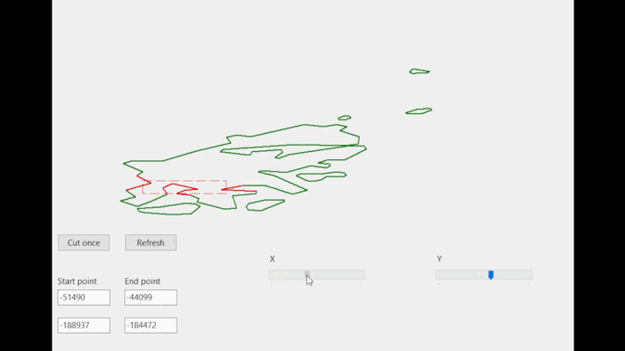

# window-cropper-visualization

Приложение отсекает отрезки не входящие в заданный прямоугольник

## О репозитории

Результат выполнения тестового задания, представляющее визуализацию отсечения отрезков

## Задания

1. Функция должна возвращать корректный набор отрезков и сохранять их в файл результатов для последующей проверки.
2. Визуализация результата добавит баллов к вашему выполнению задания.
3. Если вы учтете форматирование, используемое в предоставленных вами классах, мы также оценим вашу реализацию выше.

## Результаты

1. Функция по отсечению находится в модуле [Contour](./Contour.pas), функция CutContoursByWindow
2. Визуализация представлена в следующем пункте
3. Форматирование из готовой реализации используется в модулях [ContourFileWorker](./ContourFileWorker.pas), [CoordinateConvertor](./CoordinateConvertor.pas) и [MainForm](./MainForm.pas)

### Файл [recults.ktr](./build/results.ktr)
Содержит точки, входящие в прямоугольник (-43601, -200933; -36210, -196468), также изменяется при введении других координат прямоугольника

## Визуализация

## Установка

Готовая win32 сборка находится в [build](./build/)